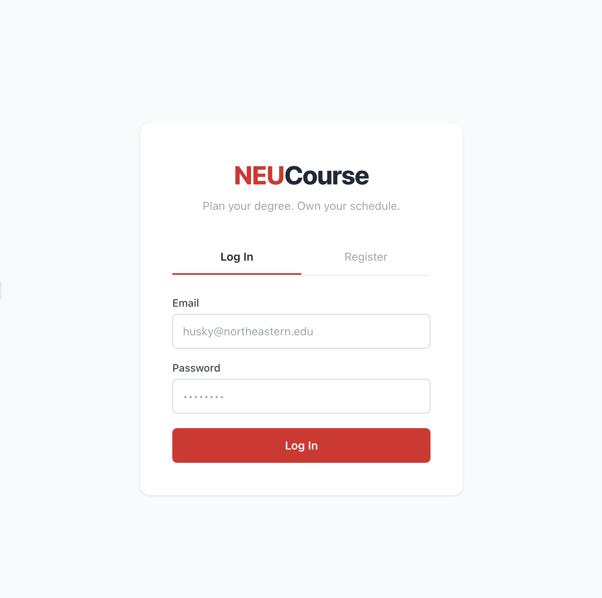
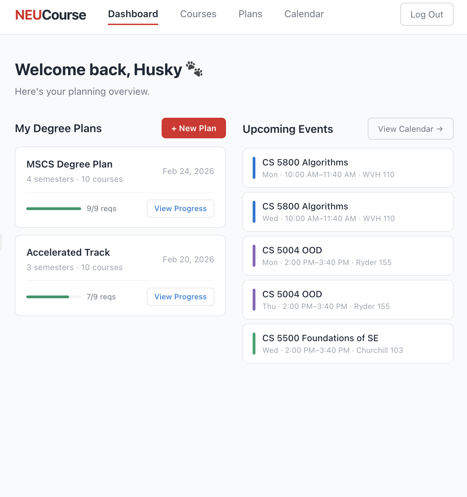
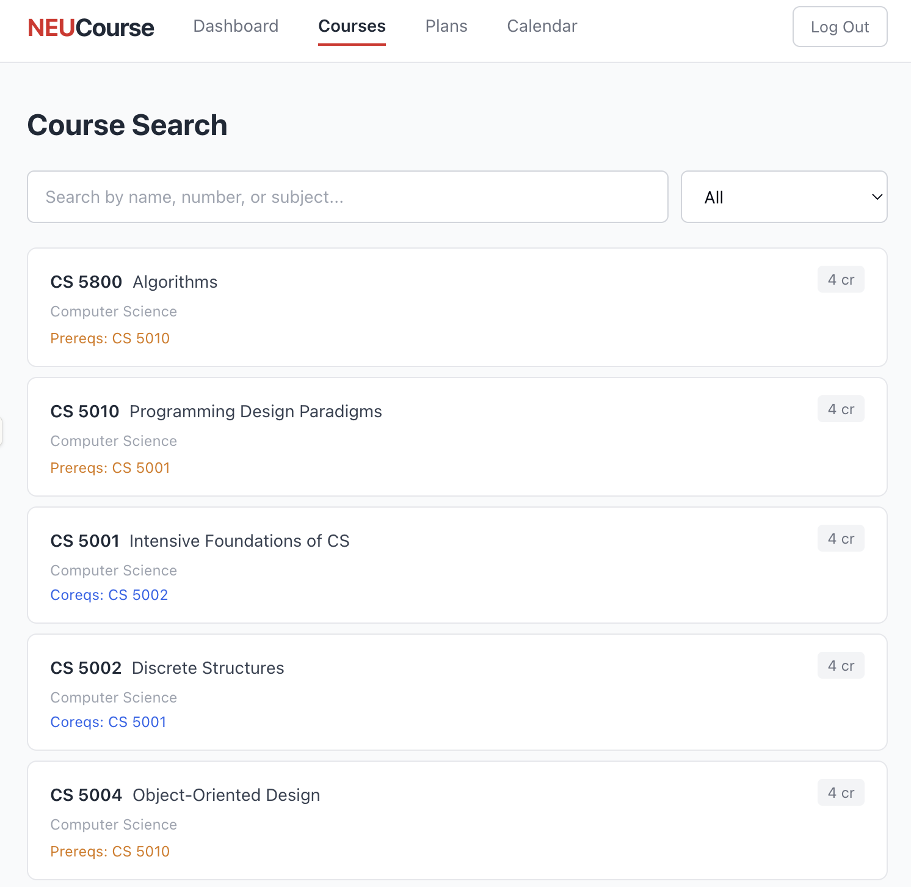
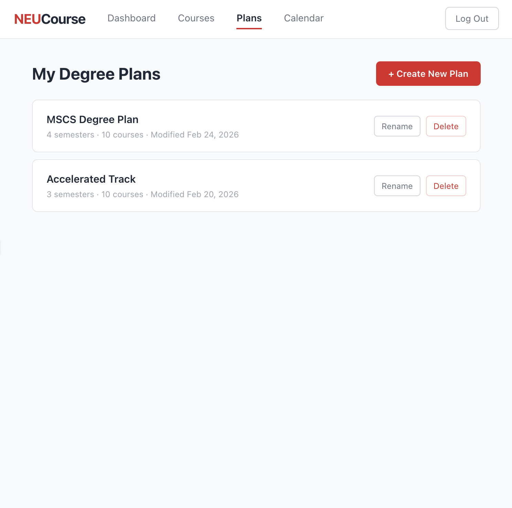
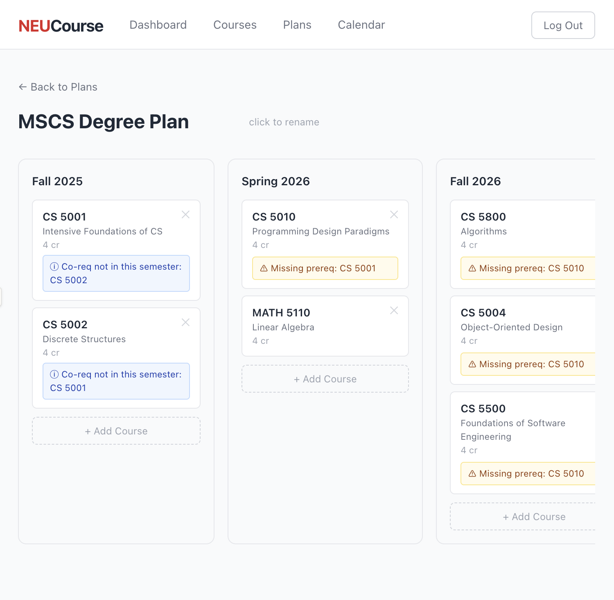
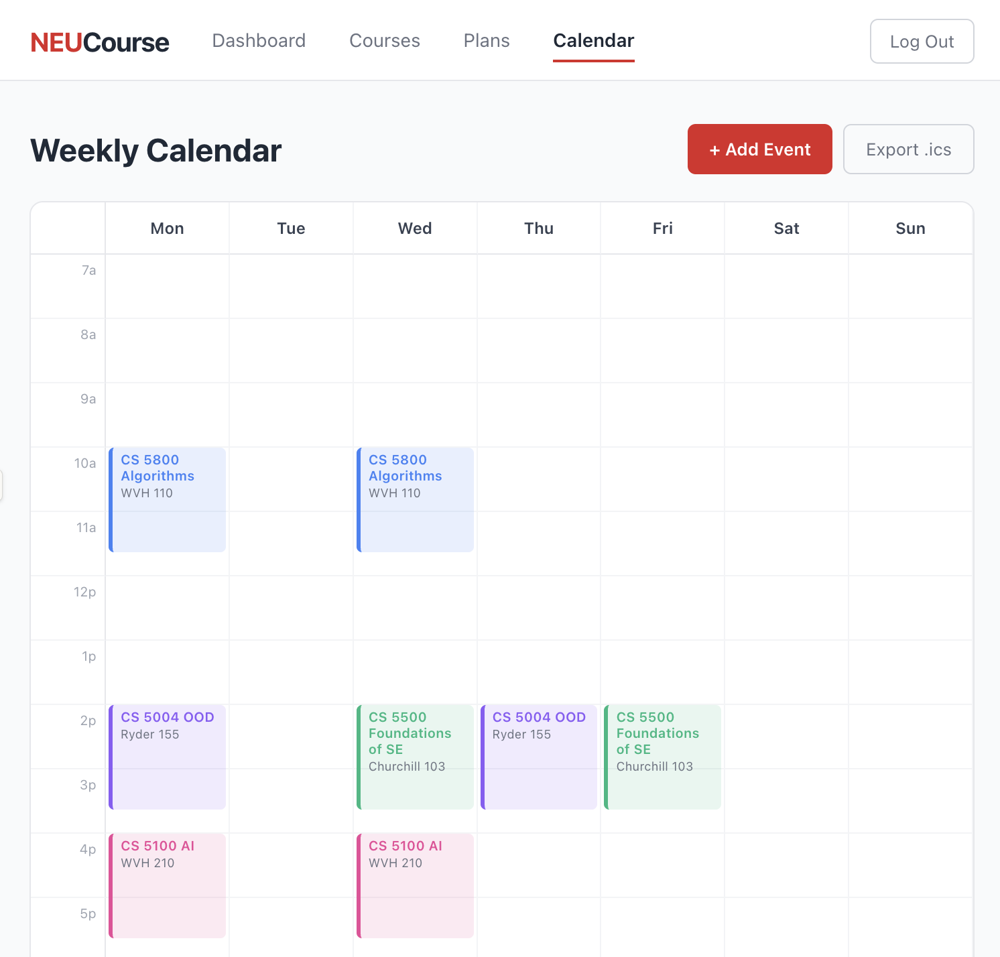

# NEUCourse

[](https://github.com/khajjafar/NEUCourse/actions/workflows/ci.yml)

A degree planning and scheduling web app for Northeastern University students. Search NEU courses, build multi-semester degree plans with prereq validation, and manage your weekly calendar — all in one place.

---

## Features

- **Course Search** — Browse and search NEU courses (scraped from searchneu.com, stored in Firestore)
- **Degree Planner** — Multi-semester plans with soft prereq/co-req validation warnings
- **Weekly Calendar** — Event management (classes, clubs, office hours) with overlap detection
- **Calendar Export** — `.ics` export compatible with Google Calendar
- **API Docs** — Interactive Swagger UI at `/api-docs`

---

## Screenshots

| Login / Register | Dashboard |
|---|---|
|  |  |

| Course Search | Degree Plan Builder |
|---|---|
|  |  |

| Plan Details | Weekly Calendar |
|---|---|
|  |  |

---

## Tech Stack

| Concern | Tool | Version |
|---|---|---|
| Framework | Next.js (App Router) | 16.1.6 |
| Language | TypeScript | ^5 |
| Styling | TailwindCSS | ^4 |
| Auth | Firebase Authentication | ^12.10.0 |
| Database | Cloud Firestore | ^12.10.0 |
| Server SDK | Firebase Admin SDK | ^13 |
| API Docs | next-swagger-doc + swagger-ui-react | latest |
| Calendar Export | ics | latest |
| Unit/Integration Tests | Vitest + React Testing Library | latest |
| E2E Tests | Playwright | latest |
| Hosting | Vercel | — |
| Runtime | Node.js LTS | — |

---

## Local Development Setup

### Prerequisites

- Node.js LTS (v20+)
- A Firebase project with Authentication and Firestore enabled
- A Firebase Admin SDK service account key

### 1. Clone the repo

```bash
git clone https://github.com/khajjafar/NEUCourse.git
cd NEUCourse
```

### 2. Install dependencies

```bash
npm install
```

### 3. Configure environment variables

Copy the example file and fill in your Firebase credentials:

```bash
cp .env.example .env.local
```

Then edit `.env.local` with your actual values (see [Environment Variables](#environment-variables) below).

### 4. Run the development server

```bash
npm run dev
```

Open [http://localhost:3000](http://localhost:3000).

### 5. Run tests

```bash
npm run test          # unit + integration tests (Vitest)
npm run coverage      # with coverage report
npm run test:e2e      # Playwright E2E tests
```

---

## Environment Variables

All variables are required. Never commit `.env.local`.

| Variable | Description |
|---|---|
| `NEXT_PUBLIC_FIREBASE_API_KEY` | Firebase client API key |
| `NEXT_PUBLIC_FIREBASE_AUTH_DOMAIN` | Firebase auth domain |
| `NEXT_PUBLIC_FIREBASE_PROJECT_ID` | Firebase project ID |
| `NEXT_PUBLIC_FIREBASE_STORAGE_BUCKET` | Firebase storage bucket |
| `NEXT_PUBLIC_FIREBASE_MESSAGING_SENDER_ID` | Firebase messaging sender ID |
| `NEXT_PUBLIC_FIREBASE_APP_ID` | Firebase app ID |
| `FIREBASE_ADMIN_PROJECT_ID` | Firebase Admin SDK project ID (server-only) |
| `FIREBASE_CLIENT_EMAIL` | Firebase Admin SDK client email (server-only) |
| `FIREBASE_PRIVATE_KEY` | Firebase Admin SDK private key (server-only) |

See [.env.example](.env.example) for the exact format.

---

## Links

| Resource | URL |
|---|---|
| Live App | [https://neucourse.vercel.app](https://neucourse.vercel.app) _(placeholder — update after deploy)_ |
| Swagger UI | `/api-docs` on the live app |
| REST API Reference | [docs/api.md](docs/api.md) |
| OpenAPI Spec (YAML) | [docs/openapi.yaml](docs/openapi.yaml) |
| Firestore Schema | [docs/firestore-schema.md](docs/firestore-schema.md) |
| Demo Video | _Coming soon_ |
| Blog Post | _Coming soon_ |

---

## CI/CD

GitHub Actions runs on every push and pull request:

1. **Lint** — ESLint
2. **Build** — `next build`
3. **Test + Coverage** — Vitest with thresholds (statements/functions/lines ≥ 80%, branches ≥ 60%)
4. **Security Audit** — `npm audit --audit-level=high`
5. **Deploy Preview** — Vercel preview URL posted as PR comment (requires `VERCEL_TOKEN`, `VERCEL_ORG_ID`, `VERCEL_PROJECT_ID` secrets)
6. **Deploy Production** — Vercel production deploy on push to `main`

See [.github/workflows/ci.yml](.github/workflows/ci.yml).

---

## Project Structure

```
/app
  /api/v1/          — REST API route handlers (authenticated via Firebase JWT)
  /dashboard/       — Dashboard page
  /courses/         — Course search page
  /plans/[planId]/  — Degree plan detail page
  /calendar/        — Weekly calendar page
  /api-docs/        — Swagger UI

/components         — React components (flat)
/hooks              — Custom React hooks
/lib                — Firebase init, API helpers (server-only utilities)
/docs               — Project documentation and wireframes
/scripts            — One-time data scraper (scrape-courses.js)
```

---

## License

MIT © 2026 Northeastern University CS7180 — Joy Thishevuri & Keeyon Khajjafar
